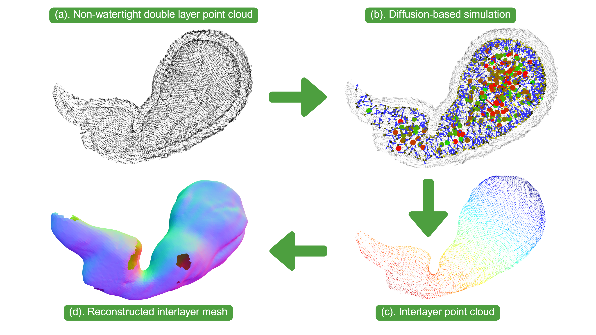
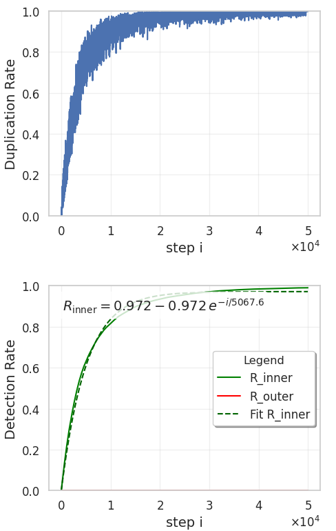

We propose a diffusion-based algorithm for separating the inter and outer layer surfaces from double-layered point clouds, particularly those exhibiting the "double surface artifact" caused by truncation in Truncated Signed Distance Function (TSDF) fusion during indoor or medical 3D reconstruction. This artifact arises from asymmetric truncation thresholds, leading to erroneous inter and outer shells in the fused volume, which our method addresses by extracting the true inter layer to mitigate challenges like overlapping surfaces and disordered normals. Our approach enables robust processing of both watertight and non-watertight 3D models, achieving extraction of the inter layer from 20,000 inter and 20,000 outer points in approximately 10 seconds. This solution is particularly effective for applications requiring accurate surface representations, such as indoor scene modeling and medical imaging, where double-layered point clouds are prevalent, and it accommodates both closed (watertight) and open (non-watertight) surface geometries. Moreover, this method is highly generalizable and does not require modifications to existing reconstruction algorithms.

# Implementation

## Overview

The diffusion algorithm simulates the movement of a ball within a hollow
3D point cloud to identify inter points of the object's geometry. The
point cloud consists of two sets of points: inter surface points (red
points ) and outer surface points (black
points). The algorithm initializes a
simulation ball at a spawn point(the purple ball marked with 0), tracks its collisions with the
point cloud, and generates new spawn points to explore the geometry. The
simulation terminates when the simulation ball collision number reaches
a predefined limit or exits the escape boundary sphere which encloses
the entire point cloud as shown by the gray dashed sphere ).

# Results

The performance of the diffusion-based algorithm is evaluated using
several metrics, particularly focusing on the duplication rate and the
detection of inter and outer layer points in a 3D point cloud model.

For the $i$-th simulation step, the duplication rate is defined as:
$$R_{dup}(i) = \frac{|\{ \text{Dup}(i) \}|}{|\{ \text{Collide}(i) \}|},$$
where $|\{ \text{Dup}(i) \}|$ is the number of duplicate collided points
(points hit multiple times) and $|\{ \text{Collide}(i) \}|$ is the total
number of collided points at step $i$. The diffusion process terminates
when $R_{dup}(i) \geq 0.99$ for 10 consecutive simulation steps,
indicating that most collisions involve previously hit points,
suggesting near-complete exploration of the inter layer.

During the simulation, the total number of steps $i$ is the sum of steps
where the simulation ball escapes the model ($N_{escape}$) and where it
remains within the model ($N_{nescap}$), i.e.,
$i = N_{escape} + N_{nescap}$. For a watertight inter layer,
$N_{escape} = 0$, as the simulation ball cannot exit. However, in a
non-watertight model, $N_{escape} > 0$. We use the criterion
$N_{escape} > 5$ to classify the point cloud model as non-watertight,
accounting for potential simulation errors.

The detected point cloud, $C_{detect}$, comprises the inter layer
points, $C_{inter}$, and outer layer points, $C_{outer}$, such that
$C_{detect} = C_{inter} + C_{outer}$. The detection rate for the inter
layer is defined as: $$R_{inter} = \frac{C_{inter}}{N_{inter}},$$ where
$N_{inter}$ is the total number of inter layer points. Ideally,
$R_{inter} = 1$ when all inter layer points are detected. Similarly, the
detection rate for the outer layer is:
$$R_{outer} = \frac{C_{outer}}{N_{outer}},$$ where $N_{outer}$ is the
total number of outer layer points. Ideally, $R_{outer} = 0$ when no
outer layer points are detected.

## Performance in Watertight 3D Model

In this simulation of a watertight double layer ball 3D mode, we set the
$R_{ball}=4R_0$, $collision \; margin=0.5 R_{ball}$,
$R_{eff} = 1.5 R_{ball}$, and $L_{max}=50R_0$, $p=0.999$, also limit
number of steps to 50 and the collisions limit as 5. And the metrics for $R_{dup}$ vs step $i$ and
$R_{inter}, R{outer}$ vs step $i$.

To quantify the performance of our diffusion-driven algorithm in
identifying inter surfaces of non-watertight point clouds, we define
$R_{\text{inter}}(i)$ as the proportion of correctly identified inter
surface points after $i$ particle simulation iterations. The convergence
of $R_{\text{inter}}$ is modeled using an exponential saturation
function:
$R_{\text{inter}}(i) = A_0 \left( 1 - \exp\left(-\frac{i}{\tau}\right) \right)$ where $A_0 = 0.970$ represents the maximum
achievable proportion of correctly identified inter points (saturation
level), and $\tau = 6424.3$ is the time constant governing the rate of
convergence. This model reflects the cumulative effect of particle
collisions, where the algorithm progressively covers the inter surface
through diffusion, with performance stabilizing as more particles are
simulated.

Results show that $R_{dup}(i)$ approaches 1 as fewer inter layer points
remain undetected, indicating convergence of the diffusion process.

## The simulation result in non-watertight 3D model

The simulation in a non-watertight 3D ball models, the metrics of
$N_{escape}$ vs step $i$ and $R_{inter}, R{outer}$ vs step $i$ is shwon
in Figure [\[fig:opensphere\]](#fig:opensphere){reference-type="ref"
reference="fig:opensphere"}. Additionally, only a small proportion(shown
in Figure [\[fig:opensphere\]](#fig:opensphere){reference-type="ref"
reference="fig:opensphere"}(b) 0.001) of outer layer points are
detected, confirming the algorithm's effectiveness in prioritizing inter
layer exploration in non-watertight models.

## Parallel Acceleration

To enhance computational efficiency, a parallelized version of the code
was developed for the simulation of 3D double layer ball models
(composed of 20000 inter points and 20000 outer points) over 500,000
steps. The performance was evaluated on an Intel Core i9-14900K CPU,
featuring 24 physical cores and 32 logical CPUs (with 2 threads per
core) running at a maximum clock speed of 6.0 GHz. Tests were conducted
across varying numbers of CPU processors, measuring both the time
consumed and the processing rate in balls per second. The results,
summarized in
Table [\[tab:parallel_performance\]](#tab:parallel_performance){reference-type="ref"
reference="tab:parallel_performance"}, demonstrate significant
improvements in computational speed with increased processor counts,
although diminishing returns are observed at higher processor numbers,
likely due to overhead in thread management or resource contention.

